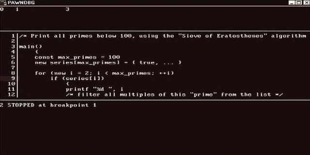
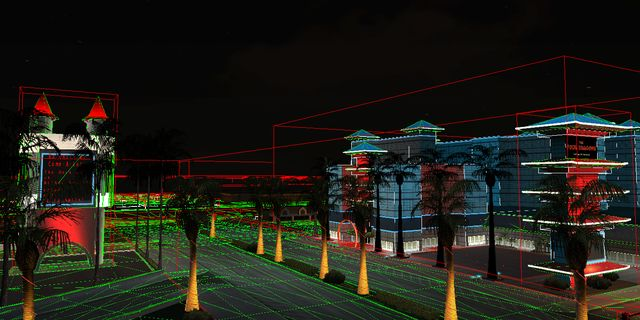

# GTA 1NSANE MAPPING

  
https://ins1x.github.io/insanemapping/  

We've collected everything you need for mapping in the GTA 3D Universe series on a single page. Here, you can find various useful tools, utilities, scripts, and tools for mapping and development. This resource was created to help mappers and developers. We tried to share our experience and accumulated resources with you.  

*   [Homepage](https://ins1x.github.io/insanemapping/index.html)
*   [Resources](https://ins1x.github.io/insanemapping/resources.html)
*   [Showroom](https://ins1x.github.io/insanemapping/showroom.html)
*   [Scripting](https://ins1x.github.io/insanemapping/scripting.html)
*   [Tools](https://ins1x.github.io/insanemapping/tools.html)
*   [Contacts](https://ins1x.github.io/insanemapping/about.html)

[Resources](https://ins1x.github.io/insanemapping/resources.html)
-------------------------------------

A collection of materials on mapping and various map editors in Grand Theft Auto. The materials are collected from various online sources and cover most topics, tools, and map editors.

**[San Andreas Multiplayer (SA:MP)](https://ins1x.github.io/insanemapping/resources.html#sa-mp)**

*   [Catalogs of object models, textures, and more](https://ins1x.github.io/insanemapping/resources.html#samp-catalogs)
*   [Bugs and troubleshooting](https://ins1x.github.io/insanemapping/resources.html#Troubleshooting)
*   [Mapping resources](https://ins1x.github.io/insanemapping/resources.html#mapping-resorces)
*   [In-game map editors on public game servers](https://ins1x.github.io/insanemapping/resources.html#ingame-map-editors)
*   [Mapping tools](https://ins1x.github.io/insanemapping/resources.html#mapping-tools)
*   [Texture Studio](https://ins1x.github.io/insanemapping/resources.html#texture-studio)

**[Multi Theft Auto (MTA)](https://ins1x.github.io/insanemapping/resources.html#multi-theft-auto)**

*   [MTA tutorials](https://ins1x.github.io/insanemapping/resources.html#mta-tutorials)
*   [MTA map editor](https://ins1x.github.io/insanemapping/resources.html#mta-map-editor)

**[Vice City Multiplayer (VC:MP)](https://ins1x.github.io/insanemapping/resources.html#vice-city-multiplayer)**

*   [Resources](https://ins1x.github.io/insanemapping/resources.html#vc-resources)

**[3D Modeling](https://ins1x.github.io/insanemapping/resources.html#3d-modeling)**

*   [3D modeling tools](https://ins1x.github.io/insanemapping/resources.html#3d-modeling-tools)
*   [Materials on 3D modeling of objects for SA:MP/MTA](https://ins1x.github.io/insanemapping/resources.html#3d-modeling-resources)

[Showroom](https://ins1x.github.io/insanemapping/showroom.html)
----------------------------------

GTA SA:MP/Open.mp mapping showroom

*   [TRAINING-SANDBOX](https://youtube.com/playlist?list=PLHO7lIOSYAVX1pbomaQylAPhJd7S7UFbv)
*   [Absolute Play Deathmatch](https://youtube.com/playlist?list=PLHO7lIOSYAVVBf4DMDbH9WsUAGz8gAaAL)
*   [UIF - United Islands Freeroam](https://youtube.com/playlist?list=PLHO7lIOSYAVXnWz2zT5PdnhGCmBkwHoz3)
*   [RSC/CW](https://youtube.com/playlist?list=PLHO7lIOSYAVVT0bVsFeFU9xUIA2mW-NvM)

[Scripting](https://ins1x.github.io/insanemapping/scripting.html)
-------------------------------------

Various useful filterscripts, includes and systems for SA-MP multiplayer

*   [useful-samp-stuff](https://github.com/ins1x/useful-samp-stuff)
*   [moonloader-scripts](https://github.com/ins1x/moonloader-scripts)
*   [mapping toolkit](https://github.com/ins1x/MappingToolkit)
*   [mtools](https://github.com/ins1x/mtools)
*   [samp-essentials](https://github.com/ins1x/samp-essentials)

[Tools](tools.html)
-------------------------

A set of utilities for mapping and development in Grand Theft Auto

**[SA:MP mapping tools](https://ins1x.github.io/insanemapping/tools.html#samp-tools)**

*   [Map editors](https://ins1x.github.io/insanemapping/tools.html#samp-map-editors)
*   [Texture-Studio](https://ins1x.github.io/insanemapping/tools.html#texture-studio)
*   [Map converters](https://ins1x.github.io/insanemapping/tools.html#map-converters)
*   [Lua scripts](https://ins1x.github.io/insanemapping/tools.html#samp-lua-scripts)
*   [Other tools](https://ins1x.github.io/insanemapping/tools.html#samp-other-tools)

**[MTA mapping tools](https://ins1x.github.io/insanemapping/tools.html#mta-tools)**

*   [Map tools and plugins](https://ins1x.github.io/insanemapping/tools.html#mta-map-tools)
*   [Other tools](https://ins1x.github.io/insanemapping/tools.html#mta-other-tools)

**[Other multiplayer's mapping tools](https://ins1x.github.io/insanemapping/tools.html#other-tools)**  

-------------------------